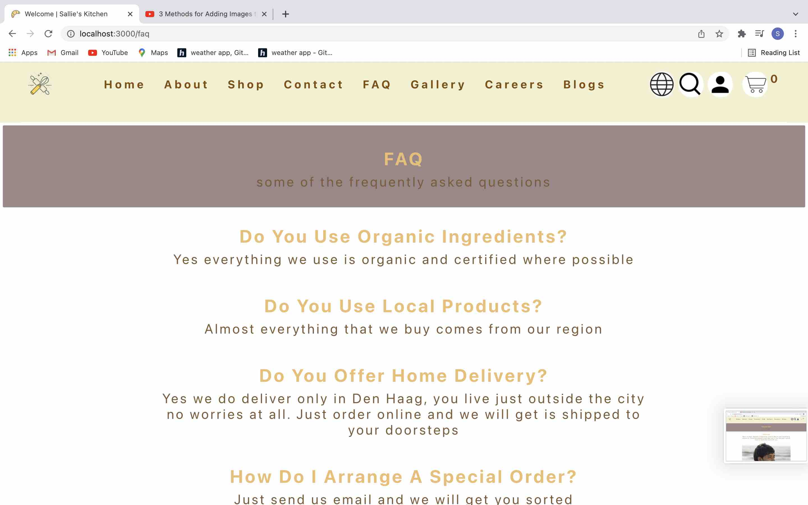

# Welcome to my 'Sallies' Kitchen App' 
In this app you are able to make an account log in/log out. You can virtually shop or look for a recipe in the search engine.

What do I need to use this app?
- Clean working computer or a modern laptop 
- An IDE such as webstorm to run this application
- Project link: `https://github.com/tosalmanshaikh/frontend-final-project-sallies-kitchen-salman-shaikh` - you can directly clone this to your IDE or zip it and open it and run it!

What do I need to install in my terminal?
- Run `npm i` in your terminal to install all the dependencies: More info about Install Node.js and NPM @ `https://docs.npmjs.com/cli/v8/commands/npm-install`
- Run `react-hook-form` in your terminal
- Run `npm i react-router-dom@5.1.2`in your terminal: we are using the old version as in the newer version things are a bit different 'Routing' wise!
- Run `npm i axios` in your terminal
- Run `npm start` to run the project

# Home

- Very simple, but a quick stroll will do

Codes: src -> components -> HomePage

# Footer

- Register | Log in

- Active links to Social media.
`Github`: this will bring you to my repository.
`Figma`: this will bring you to my figma project.
`LinkedIn`: to my personal account
`YouTube`: dedicated to Nova

- Codes: src -> components -> Footer

# About

- Simple, you also have active links here that will bring you to the shop or to the account

- Codes: src -> Pages -> About

# Shop

- You can directly click on the Add to cart button and the shopping cart will open directly
- Notice that the item in the cart is now changed to 'already in the cart'
- You can also click on the photo for a detailed description. you can add this to the cart here alternatively or go back to the products. If you click and nothing happens means your item is already in the cart.
- You can add the items in the cart or decrease the items as you wish
- You can delete the item as well by clicking on the icon on the right
- You can open the cart by clicking on the shopping cart and simply close it with the 'x' close button
- You can click on the payment if you like and that will bring you to a simple form. Once you fill this in you can click on 'Place your order'
- Your order has been placed you can now either choose to click Home | Shop

- Codes: 
1. src -> components -> Shop folder
2. src -> context -> context, StockData

# Contact, FAQ, Gallery, Careers, Blogs

- Very simple, but a quick stroll will do

- Codes: 
1. src -> Pages -> Contact
2. src -> Others -> ContactForm

# Languages

- I will be working on this in near future

- Codes: src -> pages -> Pages -> Language

# Search

- Here you can search for food recipes
- Just type any food item in the search-bar
- When you do this you can click on the ingredients alternatively you can click on the link for more details

- Codes: src -> components -> pages -> SearchBar

# Account

- You can either log in | register here
- I have used Novi backend for my project. The input field is responsive so nothing can go wrong here as the placeholder will tell you as you go 
- Once you have made an account, now you can log in with your details, only you are able to see your personal details, you will notice that the button is now switched to log-out, this simply would mean that you are logged in!
- You can choose Home | Shop or simply log out if you wish

- Codes: 
1. src -> context -> AuthContextProvider
2. src -> components -> pages -> Account

# Problems in my React App
- Responsive: Navigation bar needs a fix so that it turns into a button/modal. I plan to fix this error soon!

# Conclusion
- This being my first project I have used an older project to help me through the shopping cart. I found this project extremely challenging and yet very satisfying, I get the big picture now about 'React components'
- Here I have used the old school class base components as I wanted to start from the basic
- I am going to make a new e-commerce project right after this one, I plan to use React hooks and redux!

# Special Thanks 
- `Sam - #Hero`| Novi Hogeschool 
- `Nova` | Novi Hogeschool 
- `Florestan` | Frontend Developer 

# Git hub:  
- https://github.com/tosalmanshaikh/frontend-final-project-sallies-kitchen-salman-shaikh

# Figma:
- https://www.figma.com/file/D9eOnGY8WcL3ze2CR7Mjhs/Final-project?node-id=0%3A1

